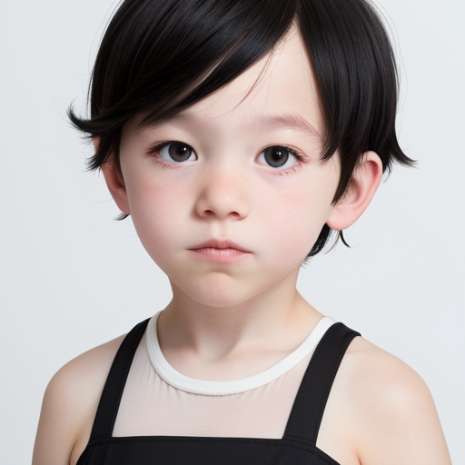
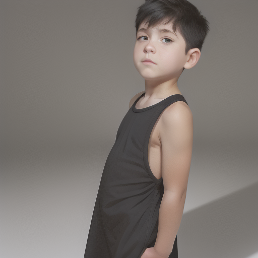
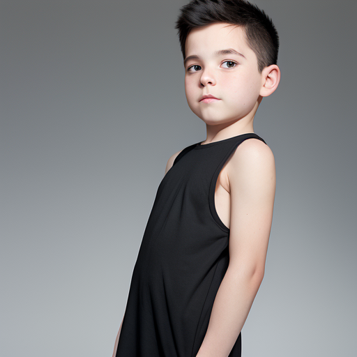

# Stable Diffusion demo


In this notebook, I will demostrate my Stable Diffusion code. To get
started, first install the model which is used in demostration from this
URL: <https://civitai.com/models/117259/anime-art-diffusion-xl> and
store this model in **stable_diffusion_v2/data/models**. Various other
models can also be downloaded and run using this code. However, you have
to update the json file stored as **models.json** in the same folder.

## Required Frameworks

I will mention the public frameworks I used in this section to get the
notebook up and running.

##### Pytorch (pip install torch)

For neural network related things.

##### tqdm (pip install tqdm)

To measure the progress during execution.

##### safetenors (pip install safetensors)

To make it being able to be used with public models in
<https://civitai.com>.

##### transformers (pip install transformers)

To tokenize the prompts for the clip model.

``` python
from stable_diffusion_v2 import StableDiffusion as sd
```

## Available Samplers

For demonstration puproses, I am using 2 samplers and there are multiple
samplers available as well in **stab_diffusion_v2/samplers** and they
can be accessed as well.

### Denoising Diffusion Probabilistic Models (DDPM)

The above paper can be accessed using the following link, which provides
the formula for variance, step and mean:
<https://arxiv.org/pdf/2006.11239.pdf>.

``` python
model_ddpm = sd(model="anime real", sampler_name="ddpm", device="cpu")
```

### Euler Ancestral

I was not able to find the link to the original sample paper. As this is
one of the most popular samplers available in Stable Diffusion
community, I implemented it using the following documentation by Hugging
Face:
<https://huggingface.co/docs/diffusers/api/schedulers/euler_ancestral>.

``` python
model_kea = sd(model="anime real", sampler_name="kea", device="cpu")
```

## Prompts and Unconditional (Negative) Prompts

Alongside prompts and unconditional prompts, the user is able to
customize the number of sampling steps and the classifier free guidance
(cfg) by using *cfg=7*. For demonstration purposes, sampling steps are
set as 30 for the samplers and cfg scale is 7.

``` python
prompt="Boy wearning black dress with a white background"
uncond_prompt="jewelery and poor quality image"
```

## Image Generation

I will use the samplers to demonstrate the image generation in this
section.

### Image Generation through DDPM Sampler

``` python
image_ddpm = model_ddpm.generate(prompt=prompt, uncond_prompt=uncond_prompt)
image_ddpm
```

    100%|██████████| 30/30 [14:19<00:00, 28.63s/it]


::: {.output .execute_result execution_count="8"}

:::
:::

::: {.cell .markdown}
### Image Generation through Euler Ancestral Sampler
:::

::: {.cell .code execution_count="9"}
``` python
image_kea = model_kea.generate(prompt=prompt, uncond_prompt=uncond_prompt)
image_kea
```

::: {.output .stream .stderr}
    100%|██████████| 30/30 [12:34<00:00, 25.16s/it]
:::

::: {.output .execute_result execution_count="9"}

:::
:::

::: {.cell .markdown}
## Varying an Image Using Samplers

We can also trick the model into creating variants of image provided
using the prompts and unconditional prompts.
:::

::: {.cell .code execution_count="11"}
``` python
image_edit = model_ddpm.generate(input_image=image_kea, prompt=prompt, uncond_prompt=uncond_prompt)
image_edit
```

::: {.output .stream .stderr}
    100%|██████████| 24/24 [11:09<00:00, 27.89s/it]
:::

::: {.output .execute_result execution_count="11"}

:::
:::

::: {.cell .code}
``` python
```
:::
